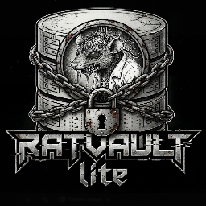

<div align="center">



# RatVault Lite

**Your personal knowledge vault — browse, search, and chat with your local markdown notes.**

No server. No cloud. No tracking. Everything stays on your device.

[](https://vault.ratlabs.tech)
[](#license)
[](#self-hosting--running-locally)
[](#features)
[](#privacy)
[](#)

[**Live App →**](https://vault.ratlabs.tech) · [Install](#install-as-pwa) · [Privacy](#privacy)

</div>

---

## Why RatVault Lite

A markdown notes app that runs entirely in your browser. It reads and writes **real `.md` files on your disk** — no proprietary format, no lock-in, no account. Add an API key and you can chat with your notes; skip it and keyword search still works offline.

## Features

| | |
|---|---|
| 📂 **Real files** | Reads/writes actual `.md` files via the File System Access API |
| 🔍 **Full-text search** | Local keyword search — no API key needed |
| 🤖 **AI chat** | Ask your notes questions (OpenRouter, OpenAI, Anthropic, or custom endpoint) |
| 🔗 **URL capture** | Save links as markdown with auto-tagging |
| 📴 **Offline** | Service worker caches the whole app — works with no connection |
| 🧩 **PWA** | Installs to your home screen on Android & iOS |
| 🦊 **Fallback mode** | IndexedDB storage for Firefox/Safari where disk access isn't available |

## Install as PWA

### Android

1. Open the app in **Chrome**
2. Tap the three-dot menu (top right)
3. Tap **"Add to Home Screen"**
4. Confirm the name and tap **"Add"**

Chrome may also show an install banner automatically.

### iOS

> Safari only — Chrome on iOS cannot install PWAs.

1. Open the app in **Safari**
2. Tap the **Share button** (box with arrow pointing up, bottom toolbar)
3. Scroll down and tap **"Add to Home Screen"**
4. Confirm the name and tap **"Add"**

After install, the app opens in standalone mode (no browser chrome). Works offline after the first visit — the service worker caches all app assets. If you reinstall or clear app data, pick the same vault folder and your notes reload automatically.

## Self-Hosting / Running Locally

No build step required.

```bash
# Serve the folder locally
python -m http.server 8080
# then open http://localhost:8080
```

Or open `index.html` directly in Chrome/Edge (`file://` — FS API and service worker won't work, but basic vault browsing does).

## API Key Setup

1. Open the **Settings** tab
2. Choose a provider (OpenRouter recommended — access to many models with one key)
3. Paste your API key — stored in IndexedDB on-device only, never sent anywhere except your chosen API endpoint

## Browser Compatibility

| Feature | Chrome / Edge | Firefox | Safari (desktop) | iOS Safari |
|---|:---:|:---:|:---:|:---:|
| File System Access (read/write disk files) | ✅ | ❌ | ❌ | ❌ |
| IndexedDB fallback (import files) | ✅ | ✅ | ✅ | ✅ |
| PWA install | ✅ | ❌ | ❌ | ✅ |
| Offline support | ✅ | ✅ | ✅ | ✅ |

## Privacy

RatVault Lite has **no analytics, no telemetry, and no developer-side servers**. Your notes and API key never leave your device, except for the requests *you* trigger to the AI endpoint you configure.

See [PRIVACY.md](PRIVACY.md) for full details.

## License

MIT
